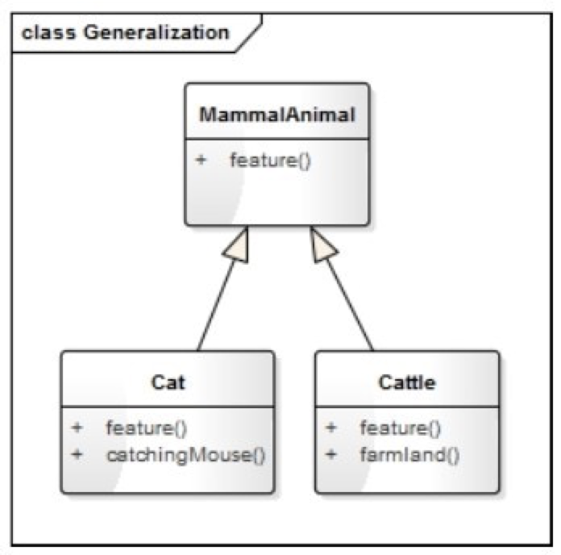
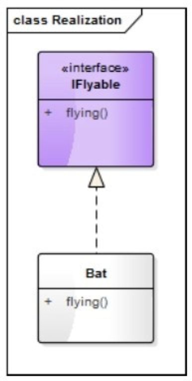
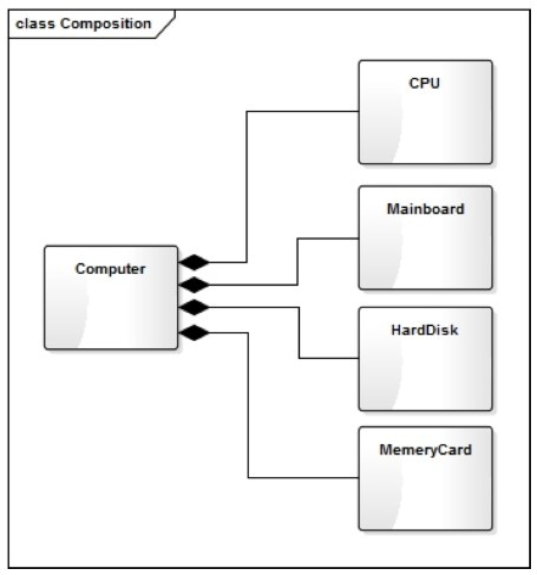
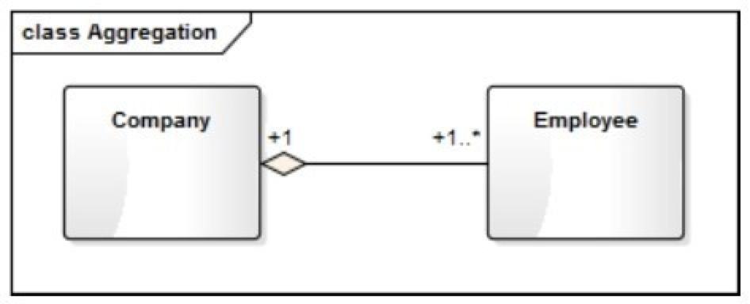
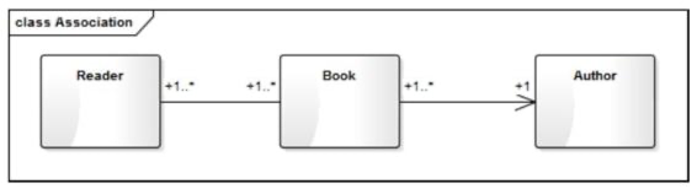
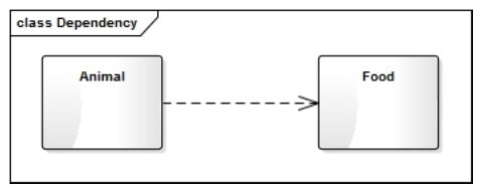

UML 类图中最常见的几种关系有：泛化（Generalization）、实现（Realization）、组合（Composition）、聚合（Aggregation）、关联（Association）和依赖（Dependency）。这些关系的强弱顺序为：泛化=实现 > 组合 > 聚合 > 关联 > 依赖。

-----

**泛化:**

继承关系,例如:人是哺乳动物,猫也是哺乳动物

**实现**

类和接口的关系,例如猫会上树,就有一个接口是`上树`的接口. 

**组合**

电脑有cpu,内存,硬盘,这些都是`必须`的组合, 组合相比聚合约束力更强.

**聚合**

1对多的组合,例如:公司和员工的关系,员工是聚合在公司

**关联**

多对多的关系, 论文与作者与读者

**依赖**

一个类的实现需要借助另一个类,例如人吃饭,人->饭之间的关系,但是不要达成双向关联!

