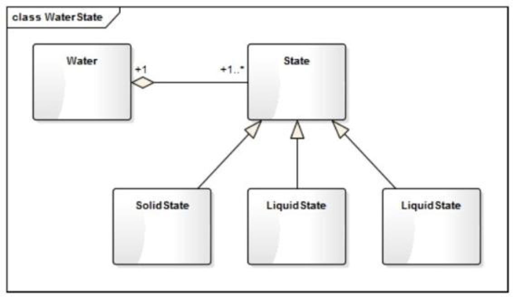
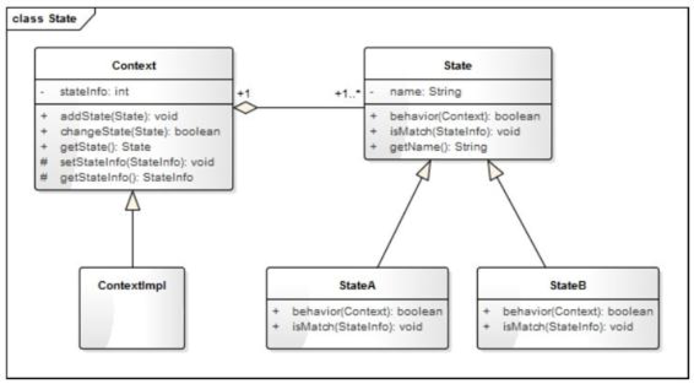
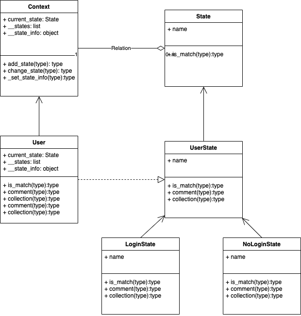

# 状态模式

水的状态有三种: 液体, 固体, 气体

当水处于的温度不一样的时候, 它的状态也会随之改变.

## 方法一

建立一个Water类和抽象类State,SolidState,LiquidState,GaseousState三个继承State类

然后由Water在`监听温度方法`中用if-else的方式去判断当前的状态.

这种方法就使得Water中`监听温度方法`无法保持程序设计中的`开放封闭原则`

## 方法二

将是否属于某一个状态的判断方法定为State中的isMatch方法,让状态自行判断是否满足条件.

## 总结

设计要领:

1. 需要实现状态模式的时候,状态会很复杂,使用isMatch方法可以传入更多的信息
2. 每一种状态应当为只有唯一实例

优点:

1. 封装了状态转换代码,对状态转换进行集中管理,而不是分散到一个个的业务逻辑中.
2. 将每个状态独立出来,开发人员只关注该状态下的逻辑开发.

应用场景:

1. 一个操作中含有庞大的多分支的条件语句,这些分支依赖于该对象的状态,且每一个分支的业务逻辑都十分的复杂,因此可以使用状态模式进行拆分成为不同的分支逻辑,提高代码的可读性和可维护性.

## 练习
1. 我们在阅读文章时,如果觉得文章写的很好,我们就会评论、收藏两连发。如果处于登录情况下,我们就可以直接做评论,收藏这些行为。否则,跳转到登录界面,登录后再继续执行先前的动作。这里涉及的状态有两种:登录与未登录,行为有两种:评论,收藏。
    
    uml图如下图,代码在hw2.py

2. 有哪些情况可以用状态模式?
   
   手机温度状态,高温降频;用户大V状态,大V在直播平台出厂都是有一些标识

